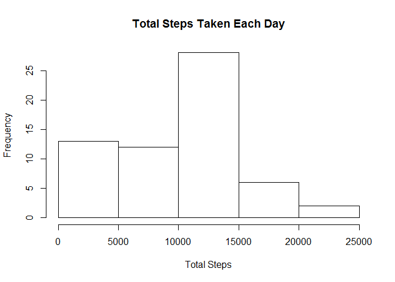
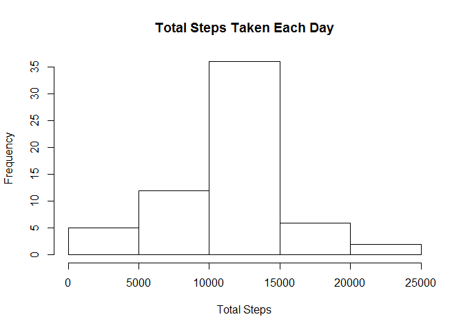
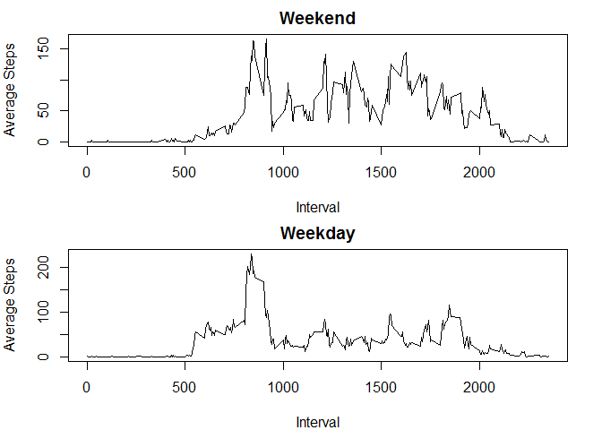

# Reproducible Research: Peer Assessment 1


## Loading and preprocessing the data
The following code was used to load the data. Because the table is
very long, only the first few rows are shown below.


```r
activity_table <- read.csv("activity.csv")
print(head(activity_table))
```

```
##   steps       date interval
## 1    NA 2012-10-01        0
## 2    NA 2012-10-01        5
## 3    NA 2012-10-01       10
## 4    NA 2012-10-01       15
## 5    NA 2012-10-01       20
## 6    NA 2012-10-01       25
```

## What is mean total number of steps taken per day?
The following code calculates the total numbers of steps taken per day.

```r
split_by_date <- split(activity_table$steps,activity_table$date)
total_steps_by_date <- sapply(split_by_date, sum, na.rm = TRUE)
print(total_steps_by_date)
```

```
## 2012-10-01 2012-10-02 2012-10-03 2012-10-04 2012-10-05 2012-10-06 
##          0        126      11352      12116      13294      15420 
## 2012-10-07 2012-10-08 2012-10-09 2012-10-10 2012-10-11 2012-10-12 
##      11015          0      12811       9900      10304      17382 
## 2012-10-13 2012-10-14 2012-10-15 2012-10-16 2012-10-17 2012-10-18 
##      12426      15098      10139      15084      13452      10056 
## 2012-10-19 2012-10-20 2012-10-21 2012-10-22 2012-10-23 2012-10-24 
##      11829      10395       8821      13460       8918       8355 
## 2012-10-25 2012-10-26 2012-10-27 2012-10-28 2012-10-29 2012-10-30 
##       2492       6778      10119      11458       5018       9819 
## 2012-10-31 2012-11-01 2012-11-02 2012-11-03 2012-11-04 2012-11-05 
##      15414          0      10600      10571          0      10439 
## 2012-11-06 2012-11-07 2012-11-08 2012-11-09 2012-11-10 2012-11-11 
##       8334      12883       3219          0          0      12608 
## 2012-11-12 2012-11-13 2012-11-14 2012-11-15 2012-11-16 2012-11-17 
##      10765       7336          0         41       5441      14339 
## 2012-11-18 2012-11-19 2012-11-20 2012-11-21 2012-11-22 2012-11-23 
##      15110       8841       4472      12787      20427      21194 
## 2012-11-24 2012-11-25 2012-11-26 2012-11-27 2012-11-28 2012-11-29 
##      14478      11834      11162      13646      10183       7047 
## 2012-11-30 
##          0
```
The following is a histogram of the total number of steps taken each day.

```r
hist(total_steps_by_date,main = "Total Steps Taken Each Day", xlab = "Total Steps")
```

 

The following code calculates the mean and median of the total number of
steps taken per day.

```r
mean(total_steps_by_date)
```

```
## [1] 9354.23
```

```r
median(total_steps_by_date)
```

```
## [1] 10395
```

## What is the average daily activity pattern?
The following code calculates the average number of steps during each time
interval and generates a time plot based on this data.

```r
split_by_interval <- split(activity_table$steps,activity_table$interval)
average_steps_by_interval <- sapply(split_by_interval,mean,na.rm = TRUE)
plot(as.numeric(names(average_steps_by_interval)),average_steps_by_interval,type = "l",
     xlab = "Interval", ylab = "Average Steps")
```

 

The following code calculates the maximum average steps out of all time intervals, and
the time of day during which it occurs.

```r
max <- max(average_steps_by_interval)
max_loc <- which.max(average_steps_by_interval)
max_time <- names(max_loc)
```
The maximum average steps was 206.1698113, at interval 835.

## Imputing missing values
The following code counts the total number of days with NA as a value for steps.

```r
sum(is.na(activity_table$steps))
```

```
## [1] 2304
```

The following code replaces the NA values with the average steps for that interval
(as calculated in the previous section). The first couple of NA replacements are shown
below as an example.

```r
print(head(activity_table))
```

```
##   steps       date interval
## 1    NA 2012-10-01        0
## 2    NA 2012-10-01        5
## 3    NA 2012-10-01       10
## 4    NA 2012-10-01       15
## 5    NA 2012-10-01       20
## 6    NA 2012-10-01       25
```

```r
for (i in 1:length(activity_table$steps)){
    if(is.na(activity_table$steps[i]) == TRUE){
        activity_table$steps[i] <- average_steps_by_interval[as.character(activity_table$interval[i])]
    }
}
print(head(activity_table))
```

```
##       steps       date interval
## 1 1.7169811 2012-10-01        0
## 2 0.3396226 2012-10-01        5
## 3 0.1320755 2012-10-01       10
## 4 0.1509434 2012-10-01       15
## 5 0.0754717 2012-10-01       20
## 6 2.0943396 2012-10-01       25
```
The following code calculates the total number of steps taken per day with the NA
replacements and constructs a histogram.

```r
split_by_date <- split(activity_table$steps,activity_table$date)
total_steps_by_date <- sapply(split_by_date, sum, na.rm = TRUE)
print(total_steps_by_date)
```

```
## 2012-10-01 2012-10-02 2012-10-03 2012-10-04 2012-10-05 2012-10-06 
##   10766.19     126.00   11352.00   12116.00   13294.00   15420.00 
## 2012-10-07 2012-10-08 2012-10-09 2012-10-10 2012-10-11 2012-10-12 
##   11015.00   10766.19   12811.00    9900.00   10304.00   17382.00 
## 2012-10-13 2012-10-14 2012-10-15 2012-10-16 2012-10-17 2012-10-18 
##   12426.00   15098.00   10139.00   15084.00   13452.00   10056.00 
## 2012-10-19 2012-10-20 2012-10-21 2012-10-22 2012-10-23 2012-10-24 
##   11829.00   10395.00    8821.00   13460.00    8918.00    8355.00 
## 2012-10-25 2012-10-26 2012-10-27 2012-10-28 2012-10-29 2012-10-30 
##    2492.00    6778.00   10119.00   11458.00    5018.00    9819.00 
## 2012-10-31 2012-11-01 2012-11-02 2012-11-03 2012-11-04 2012-11-05 
##   15414.00   10766.19   10600.00   10571.00   10766.19   10439.00 
## 2012-11-06 2012-11-07 2012-11-08 2012-11-09 2012-11-10 2012-11-11 
##    8334.00   12883.00    3219.00   10766.19   10766.19   12608.00 
## 2012-11-12 2012-11-13 2012-11-14 2012-11-15 2012-11-16 2012-11-17 
##   10765.00    7336.00   10766.19      41.00    5441.00   14339.00 
## 2012-11-18 2012-11-19 2012-11-20 2012-11-21 2012-11-22 2012-11-23 
##   15110.00    8841.00    4472.00   12787.00   20427.00   21194.00 
## 2012-11-24 2012-11-25 2012-11-26 2012-11-27 2012-11-28 2012-11-29 
##   14478.00   11834.00   11162.00   13646.00   10183.00    7047.00 
## 2012-11-30 
##   10766.19
```

```r
hist(total_steps_by_date,main = "Total Steps Taken Each Day", xlab = "Total Steps")
```

 

The following code calculates the mean and median for this data with NA replacements.

```r
mean(total_steps_by_date)
```

```
## [1] 10766.19
```

```r
median(total_steps_by_date)
```

```
## [1] 10766.19
```

Replacing the NA values with the average for that time interval raises both the mean and
median total steps per day to 10766.19. Based on the histogram, the relative frequency of days
in which the total number of steps is below average decreases significantly. This probably occurs
because NA values were previously counted as 0 when omitted and therefore skewed total steps per
day towards lower numbers.

## Are there differences in activity patterns between weekdays and weekends?
The following code categorizes dates in the dataset into weekdays and weekends.


```r
library(lubridate)
for (i in 1:length(activity_table$steps)){
    if((wday(activity_table$date[i]) == 1) | (wday(activity_table$date[i]) == 7)){
        activity_table$Weektime[i] <- "Weekend"
    }
    else {
        activity_table$Weektime[i] <- "Weekday"
    }
}
weektime_split <- split(activity_table,activity_table$Weektime)
weekend <- weektime_split$Weekend
weekday <- weektime_split$Weekday
```
The following code creates a plot with two panels, one for weekdays and one for weekends. Each panel
shows the average steps for each interval.


```r
par(mfrow = c(2,1))
par(mar = c(4,4,2,2))
#Weekend Plot
weekend_interval <- split(weekend$steps,weekend$interval)
weekend_average <- sapply(weekend_interval,mean,na.rm = TRUE)
plot(as.numeric(names(weekend_average)),weekend_average,type = "l",
     xlab = "Interval", ylab = "Average Steps", main = "Weekend")
#Weekday Plot
weekday_interval <- split(weekday$steps,weekday$interval)
weekday_average <- sapply(weekday_interval,mean,na.rm = TRUE)
plot(as.numeric(names(weekday_average)),weekday_average,type = "l",
     xlab = "Interval", ylab = "Average Steps", main = "Weekday")
```

 

The average steps later in the day seem to be lower on weekdays than on weekends.
